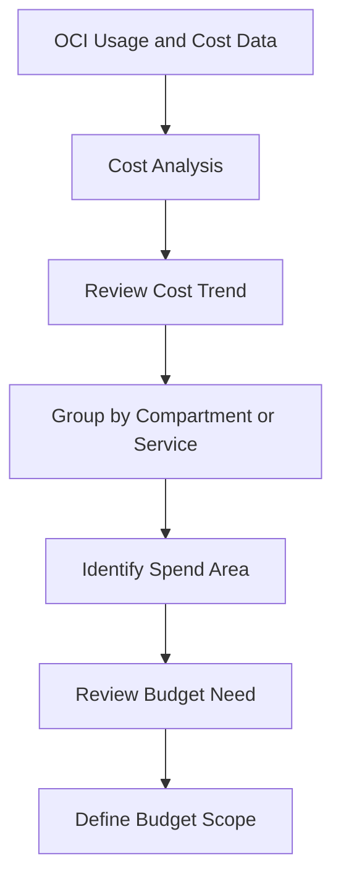
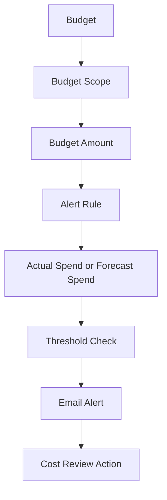

# OCI Cost Budget Alert and Cost Review Flow

## Overview

This repository explains a simple cost review and budget alert flow in Oracle Cloud Infrastructure.
It covers how Cost Analysis, Budgets, budget scope, actual spend, forecast spend, and budget alert rules work together.
The focus is simple:

- Review cost trends
- Define the budget scope
- Set the budget amount
- Configure an alert rule
- Review actual or forecast spend
- Take action when an alert is received

No confidential information, tenancy details, OCIDs, real cost values, invoice details, real email addresses, or project-specific information is included.

---

## Why I Created This

Cost visibility should not happen only after spend has already increased.
A useful cost review process needs a clear flow. The cost should be reviewed regularly. The budget scope should be clear. The alert rule should be meaningful. The notification should help the right person review the spend early.
This repository keeps that flow simple and easy to understand.

---

## Product Used

Oracle Cloud Infrastructure Cost Management and Budgets

---

## Cost Review Flow

---

## Budget Alert Flow

---

## Components Covered

This repository covers the following OCI areas:

- Cost Management
- Cost Analysis
- Budgets
- Budget scope
- Actual spend
- Forecast spend
- Budget alert rules
- Alert threshold
- Cost review points
- Basic follow-up actions

---
## What I Understood

My main understanding is that cost review should not be treated as only checking a final bill.
A useful cost control flow needs Cost Analysis, budget scope, budget amount, alert rule, and review action to work together.
Cost Analysis helps show where the spend is coming from. A budget gives a spending reference point. A budget alert helps notify when actual or forecast spend reaches the selected threshold.
If the budget scope or alert rule is not clear, the alert may not help the right review happen at the right time.
