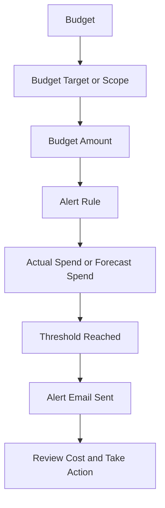

# Budget Alert Flow

This diagram shows a simple budget alert flow in OCI.

A budget alert does not replace cost review.
It helps bring attention when actual or forecast spend reaches the selected threshold.

---

## What I Understood

My main understanding is that a budget alert should be connected to a clear review action.
The alert is useful only when someone knows what to check after receiving it.
