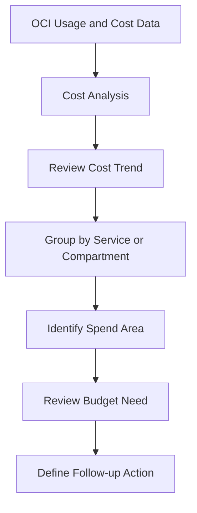

# Cost Review Flow

This diagram shows a simple OCI cost review flow.

Cost review starts with visibility.

Cost Analysis helps review usage and cost information so the spend can be understood by service, compartment, or other available filters.

---

## What I Understood

My main understanding is that cost review should start with the cost trend.
Before creating or changing a budget, the spend area should be reviewed. The review should make clear where the cost is coming from and whether a budget or alert is needed.
