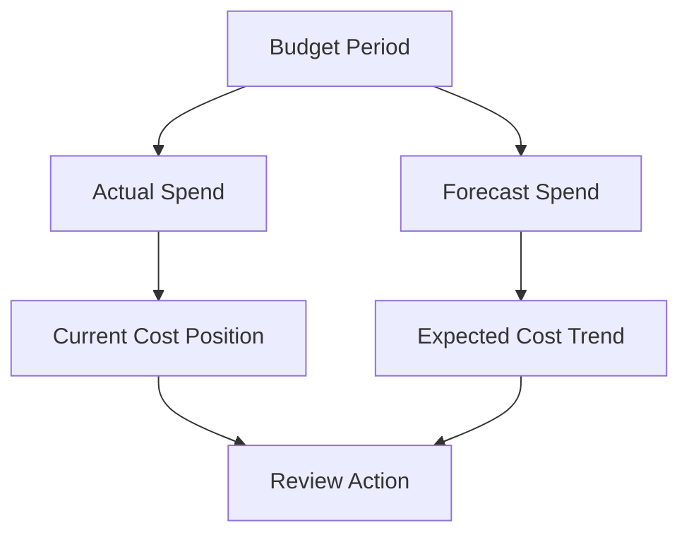

# Actual vs Forecast Review

## Overview

Budget alerts can be reviewed using actual spend or forecast spend.
Both are useful, but they answer different questions.
Actual spend shows what has already happened.
Forecast spend helps show what may happen if the current trend continues.

---

## Actual Spend Review

Actual spend is useful for reviewing current cost position.

It can help answer:

- How much spend has already occurred?
- Has the spend reached the selected threshold?
- Which area should be reviewed now?
- Is the cost still within the expected range?

---

## Forecast Spend Review

Forecast spend is useful for early warning.

It can help answer:

- Is the budget likely to be exceeded?
- Is the current usage trend increasing?
- Should the team review usage before the period ends?
- Is action needed before actual spend crosses the limit?

---

## Simple Flow

---

## Review Points

When reviewing actual and forecast spend, these points should be checked:

- Budget period
- Current spend
- Forecast trend
- Threshold used
- Scope of the budget
- Whether the spend is expected
- What follow-up action is needed

---

## What I Understood

My main understanding is that actual and forecast spend should not be treated the same.
Actual spend shows the current position. Forecast spend helps with early review.
For cost control, forecast alerts can be helpful because they give time to review before the budget is exceeded.
