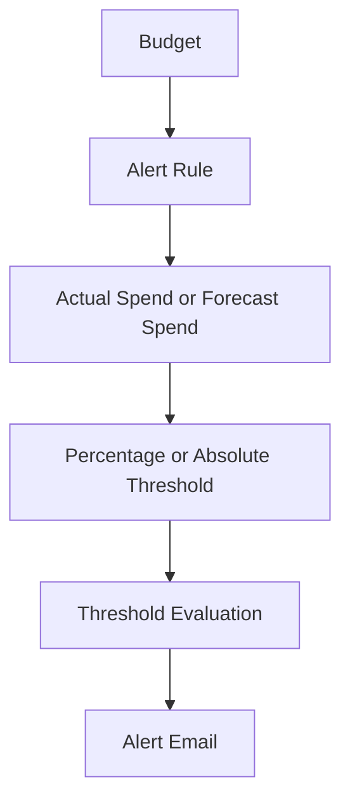

# Budget Alert Rule

## Overview

A budget alert rule defines when an alert should be sent.
The rule can be based on actual spend or forecast spend.
The threshold can be based on a percentage of the budget or an absolute amount.

---

## Alert Rule Flow



---

## Actual Spend

Actual spend is based on the spend that has already occurred during the budget period.
An actual spend alert is useful when the budget owner wants to know when current spend has reached a defined level.

---

## Forecast Spend

Forecast spend is based on the expected spend trend for the budget period.
A forecast spend alert is useful when the budget owner wants early visibility that the budget may be exceeded before the period ends.

---

## Threshold Type

A budget alert threshold can be reviewed in two simple ways:

```text
Percentage threshold
Absolute amount threshold
```

A percentage threshold is based on a percentage of the budget.
An absolute amount threshold is based on a specific amount.
This repository does not include real threshold amounts or real cost values.

---

## Review Points

Before using an alert rule, these points should be checked:

- Is the rule based on actual spend or forecast spend?
- Is the threshold percentage or absolute amount?
- Is the alert recipient correct?
- Is the budget scope correct?
- Is the alert message clear enough?
- What should be reviewed when the alert is received?

---

## What I Understood

My main understanding is that a budget alert rule should not be created just to send an email.
The rule should have a clear purpose. It should help the right person review spend at the right time.
