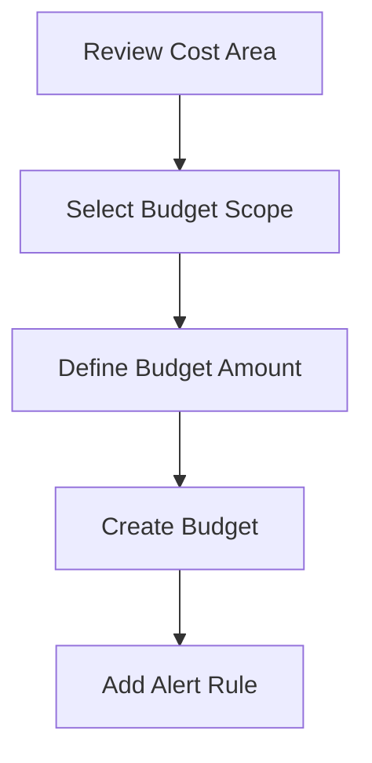

# Budget Target and Scope

## Overview

A budget needs a clear target or scope.
The budget scope defines what spend the budget is tracking.
If the scope is not clear, the budget alert may not give useful information.

---

## Budget Scope

A budget can be connected to a defined area of spend.

Examples of budget scope can include:

- A compartment
- A cost-tracking tag
- A selected area of cloud usage, depending on the setup

The scope should match the area that needs review.

---

## Budget Amount

The budget amount is the spending reference for the selected scope.
The amount should not be selected randomly. It should be based on the expected spend, historical trend, or agreed review limit.
This repository does not include real budget values.

---

## Simple Flow

---

## Review Points

Before creating a budget, these points should be checked:

- What spend area needs review
- Whether the scope is correct
- Whether the budget amount makes sense
- Who should receive the alert
- What action should be taken when an alert is received

---

## What I Understood

My main understanding is that budget scope is important.
A budget is useful only when it tracks the right area. If the scope is too broad, the alert may not show the real issue. If the scope is too narrow, important spend may be missed.
