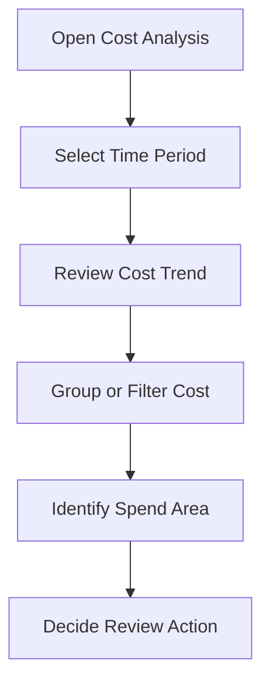

# Cost Analysis Overview

## Overview

Cost Analysis is used to review cost and usage information in Oracle Cloud Infrastructure.
It helps users understand where cloud spend is coming from.
Cost can be reviewed using available filters and grouping options such as service, compartment, tag, or time period, depending on the setup and available data.

---

## Why Cost Analysis Matters

Cost Analysis is useful because it gives visibility before a budget alert becomes the only signal.
It can help answer basic questions:

- Which service is contributing to spend?
- Which compartment needs review?
- Is the spend increasing over time?
- Does the spend look expected?
- Is a budget or alert needed for this area?

---

## Simple Flow

---

## Review Points

Before using cost data for follow-up, these points should be checked:

- Correct time period
- Correct compartment or scope
- Correct service grouping
- Whether the trend is expected
- Whether any spend area needs a budget
- Whether the report should be saved or reviewed again later

---

## What I Understood

My main understanding is that Cost Analysis is the starting point for cost review.
A budget alert can tell when spend reaches a threshold, but Cost Analysis helps understand where the spend is coming from.
Both should be used together.
