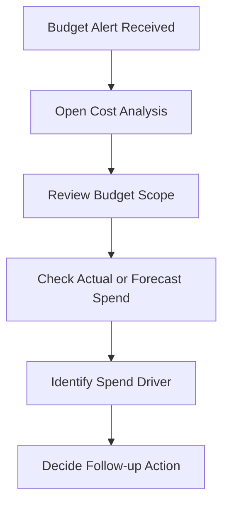

# Cost Review Control Points

## Overview

A budget alert is useful only when there is a review process after the alert.
This document lists simple control points that can be reviewed when a budget alert is received.

---

## Basic Control Points

When a budget alert is received, the reviewer can check:

- Which budget triggered the alert
- Whether the alert is based on actual or forecast spend
- Which scope the budget is tracking
- Which service or compartment is contributing to spend
- Whether the spend is expected
- Whether any usage needs follow-up
- Whether the budget or alert rule needs adjustment

---

## Review Flow

---

## Follow-up Examples

Possible follow-up actions can include:

- Review the service contributing to spend
- Review compartment-level usage
- Confirm whether the spend is expected
- Check if the budget scope is correct
- Update alert threshold if the current threshold is not useful
- Share the cost review with the right owner

---

## What I Understood

My main understanding is that the alert is only the starting point.
The value comes from the review after the alert. Someone still needs to check the cost area, understand why the alert fired, and decide the right follow-up.
